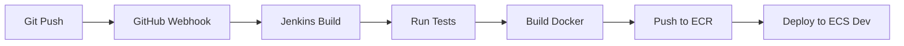
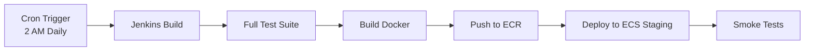
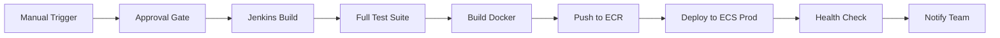

# Jenkins CI/CD Quick Reference

Quick reference guide for common Jenkins CI/CD operations for the Task Activity Tracking application.

## Quick Links

-   [Full Setup Guide](JENKINS_SETUP.md)
-   [Environment Configuration](JENKINS_ENVIRONMENTS.md)
-   [Jenkinsfile](../Jenkinsfile)
-   [Helper Scripts](../jenkins/)

## Common Commands

### Trigger Build via UI

1. Navigate to Jenkins: `http://your-jenkins-url:8081`
2. Click on **TaskActivity-Pipeline**
3. Click **Build with Parameters**
4. Select options:
    - **ENVIRONMENT:** `dev`, `staging`, or `production`
    - **DEPLOY_ACTION:** `deploy`, `build-only`, or `rollback`
    - **SKIP_TESTS:** `false` (recommended)
    - **NO_CACHE:** `false` (use `true` to force complete rebuild)
5. Click **Build**

### Trigger Build via CLI

```bash
# Install Jenkins CLI first
curl -o jenkins-cli.jar http://your-jenkins-url:8081/jnlpJars/jenkins-cli.jar

# Deploy to dev
java -jar jenkins-cli.jar -s http://your-jenkins-url:8081/ \
  -auth user:token build TaskActivity-Pipeline \
  -p ENVIRONMENT=dev -p DEPLOY_ACTION=deploy

# Deploy to production
java -jar jenkins-cli.jar -s http://your-jenkins-url:8081/ \
  -auth user:token build TaskActivity-Pipeline \
  -p ENVIRONMENT=production -p DEPLOY_ACTION=deploy
```

### Using Helper Scripts

```bash
cd jenkins

# Check deployment status
./check-deployment.sh production

# Trigger build
export JENKINS_URL="http://your-jenkins-url:8081"
export JENKINS_USER="your-username"
export JENKINS_TOKEN="your-api-token"
./trigger-build.sh production deploy

# Verify environment
./verify-environment.sh production

# Cleanup old images
./cleanup-old-images.sh --dry-run
./cleanup-old-images.sh --keep 5
```

## Deployment Workflows

### Dev Deployment (Continuous)



**Automatic on every push to main branch**

### Staging Deployment (Daily)



**Automatic nightly or manual trigger**

### Production Deployment (Manual with Approval)



**Requires manual approval**

## Pipeline Parameters

| Parameter       | Values                       | Description                    |
| --------------- | ---------------------------- | ------------------------------ |
| `ENVIRONMENT`   | dev, staging, production     | Target environment             |
| `DEPLOY_ACTION` | deploy, build-only, rollback | Action to perform              |
| `SKIP_TESTS`    | true, false                  | Skip unit tests (not for prod) |
| `NO_CACHE`      | true, false                  | Build without Docker cache     |

## Build Stages

The Jenkins pipeline executes these stages:

1. **Initialize** - Display build info
2. **Checkout** - Clone repository
3. **Build & Test** - Maven build and unit tests
4. **Code Quality** - Optional SonarQube scan
5. **Build Docker Image** - Create container image
6. **Security Scan** - Optional vulnerability scan
7. **Push to ECR** - Upload to Amazon ECR
8. **Deploy to ECS** - Update ECS service
9. **Verify Deployment** - Health check validation
10. **Cleanup** - Remove local Docker images

## Monitoring Builds

### Via Jenkins UI

-   **Console Output:** Real-time build logs
-   **Pipeline Steps:** Visual stage progress
-   **Test Results:** JUnit test reports
-   **Artifacts:** Built JAR files

### Via Command Line

```bash
# Get build status
aws ecs describe-services \
  --cluster taskactivity-cluster-production \
  --services taskactivity-service-production

# View logs
aws logs tail /ecs/taskactivity-production --follow

# Check tasks
aws ecs list-tasks \
  --cluster taskactivity-cluster-production \
  --service-name taskactivity-service-production
```

## Rollback Procedures

### Via Jenkins

1. Go to **TaskActivity-Pipeline**
2. Click **Build with Parameters**
3. Select:
    - **ENVIRONMENT:** `production`
    - **DEPLOY_ACTION:** `rollback`
4. Click **Build**

### Via AWS CLI

```bash
# List recent task definitions
aws ecs list-task-definitions \
  --family-prefix taskactivity-task-production \
  --status ACTIVE \
  --sort DESC \
  --max-items 5

# Rollback to previous version
aws ecs update-service \
  --cluster taskactivity-cluster-production \
  --service taskactivity-service-production \
  --task-definition taskactivity-task-production:PREVIOUS_REVISION
```

## Troubleshooting

### Build Failures

**Maven Build Errors:**

```bash
# Check Java version
java -version  # Should be 21

# Clean Maven cache
./mvnw clean -U
```

**Docker Build Errors:**

```bash
# Check Docker daemon
docker info

# Build with no cache
# Set NO_CACHE=true in Jenkins
```

**ECR Push Errors:**

```bash
# Refresh ECR login
aws ecr get-login-password --region us-east-1 | \
  docker login --username AWS --password-stdin \
  YOUR_ACCOUNT.dkr.ecr.us-east-1.amazonaws.com
```

### Deployment Failures

**ECS Service Not Updating:**

```bash
# Check service events
aws ecs describe-services \
  --cluster taskactivity-cluster-production \
  --services taskactivity-service-production \
  --query 'services[0].events[0:5]'

# Force new deployment
aws ecs update-service \
  --cluster taskactivity-cluster-production \
  --service taskactivity-service-production \
  --force-new-deployment
```

**Tasks Not Starting:**

```bash
# Check stopped tasks
aws ecs describe-tasks \
  --cluster taskactivity-cluster-production \
  --tasks $(aws ecs list-tasks \
    --cluster taskactivity-cluster-production \
    --desired-status STOPPED \
    --query 'taskArns[0]' --output text)
```

### Common Error Messages

| Error                       | Cause                     | Solution                |
| --------------------------- | ------------------------- | ----------------------- |
| `no basic auth credentials` | ECR login expired         | Refresh ECR credentials |
| `desired count not reached` | Task health check failing | Check application logs  |
| `Task failed to start`      | Resource limits           | Increase CPU/memory     |
| `Secret not found`          | Missing Secrets Manager   | Create required secrets |

## Environment URLs

After deployment, access your application:

-   **Dev:** Check ECS task public IP

    ```bash
    aws ecs describe-tasks --cluster taskactivity-cluster-dev \
      --tasks $(aws ecs list-tasks --cluster taskactivity-cluster-dev \
      --query 'taskArns[0]' --output text) \
      --query 'tasks[0].attachments[0].details[?name==`networkInterfaceId`].value' \
      --output text
    ```

-   **Staging:** `http://staging-alb-url.region.elb.amazonaws.com`

-   **Production:** `https://your-domain.com` (via Cloudflare)

## Security Best Practices

-   ✅ Never commit AWS credentials to Git
-   ✅ Use AWS Secrets Manager for sensitive data
-   ✅ Rotate Jenkins API tokens regularly
-   ✅ Enable GitHub webhook secret validation
-   ✅ Restrict Jenkins to specific IP ranges
-   ✅ Always run tests before production deploy
-   ✅ Require approval for production changes
-   ✅ Monitor CloudWatch for errors
-   ✅ Enable audit logging in Jenkins
-   ✅ Use least-privilege IAM policies

## Cost Optimization

### ECR Image Management

```bash
# Remove old images (keep latest 10)
./jenkins/cleanup-old-images.sh --keep 10

# Lifecycle policy (create once)
aws ecr put-lifecycle-policy \
  --repository-name taskactivity \
  --lifecycle-policy-text file://ecr-lifecycle-policy.json
```

**ecr-lifecycle-policy.json:**

```json
{
    "rules": [
        {
            "rulePriority": 1,
            "description": "Keep last 10 images",
            "selection": {
                "tagStatus": "any",
                "countType": "imageCountMoreThan",
                "countNumber": 10
            },
            "action": {
                "type": "expire"
            }
        }
    ]
}
```

### ECS Cost Management

-   **Dev:** 1 task, smallest size (256 CPU, 512 MB)
-   **Staging:** 1 task, medium size (512 CPU, 1024 MB)
-   **Production:** 2+ tasks with auto-scaling

## Next Steps

After setting up Jenkins CI/CD:

1. ✅ Configure email/Slack notifications
2. ✅ Set up SonarQube for code quality
3. ✅ Add security scanning (Trivy, Snyk)
4. ✅ Create runbook for common issues
5. ✅ Set up monitoring dashboards
6. ✅ Document incident response procedures
7. ✅ Schedule regular security audits

## Support Resources

-   [Jenkins Documentation](https://www.jenkins.io/doc/)
-   [AWS ECS Documentation](https://docs.aws.amazon.com/ecs/)
-   [Docker Best Practices](https://docs.docker.com/develop/dev-best-practices/)
-   [Spring Boot on AWS](https://spring.io/guides/gs/spring-boot-docker/)

---

**Last Updated:** October 2025  
**Maintained By:** DevOps Team
